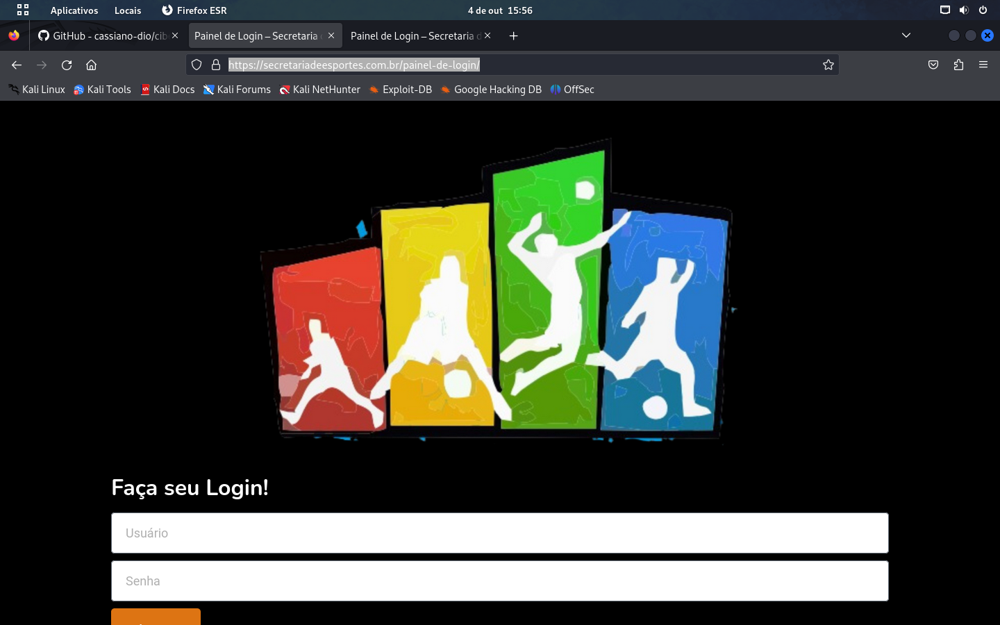
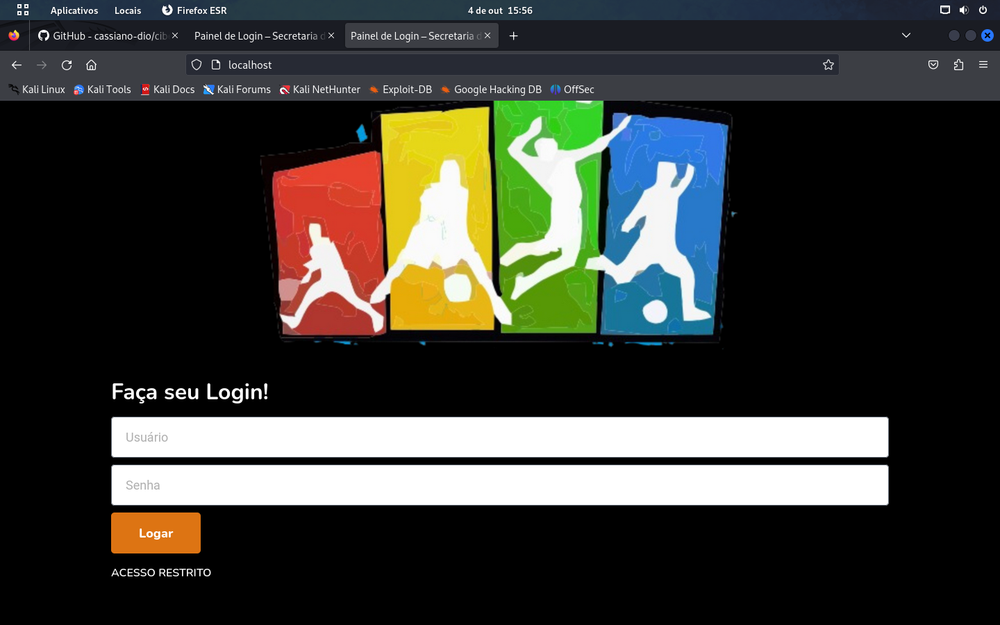
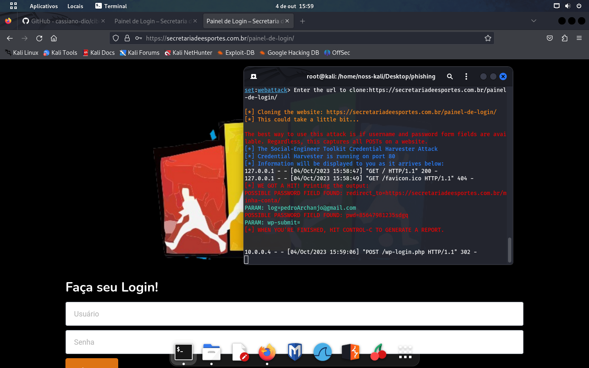

# Desafio Dio: Phishing para captura de senhas

### Ferramentas:

- Kali Linux
- setoolkit

### Observações:

- 1- Utilizei o site "https://secretariadeesportes.com.br/painel-de-login/" para o teste, pois o site sugerido estava retornando somente o e-mail, porém as senhas não eram retornadas.
  
 

- 2- Segui o passo-a-passo sugerido no repositório relacionado a aula do curso. 
  
        Link: https://github.com/cassiano-dio/cibersecurity-desafio-phishing

- 3- O site foi clonado com sucesso.
  

- 4- Ao final, os dados inseridos devem ser retornados no terminal. 
  
### Resutados:

- 5- Apresentação dos dados no terminal

